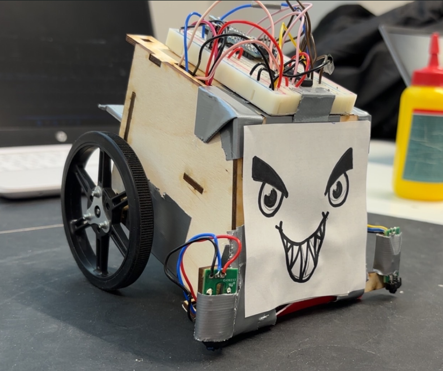
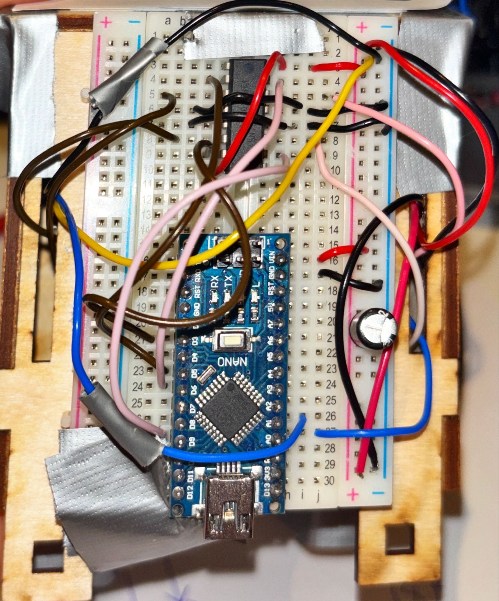
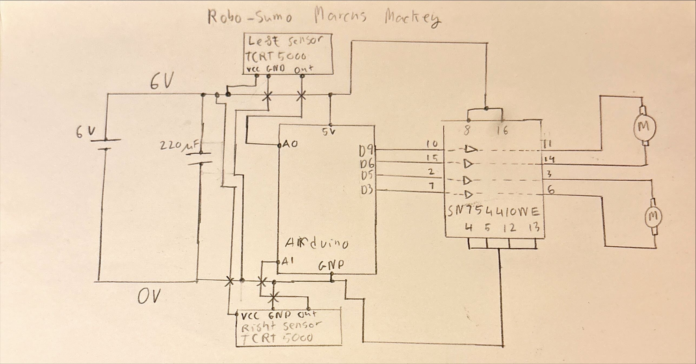
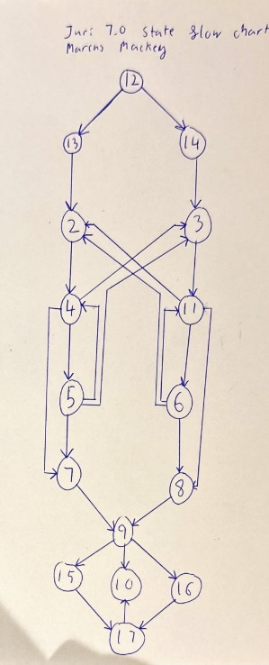
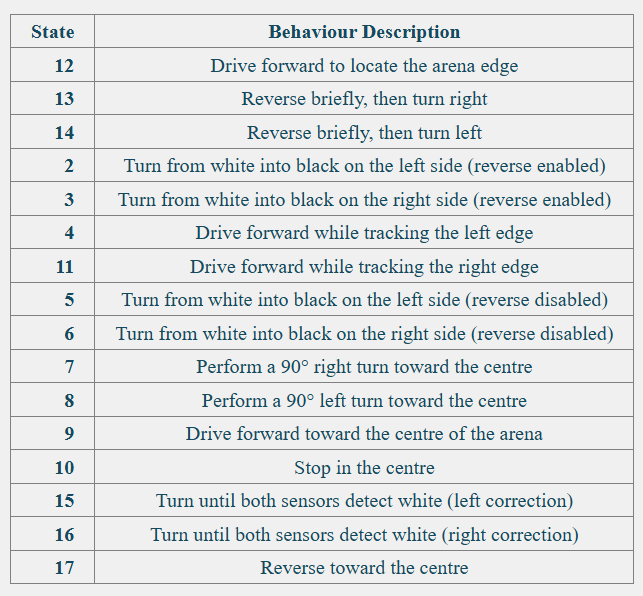

# RoboSumo Autonomous Robot

Autonomous RoboSumo robot developed as part of my first-year engineering coursework at Technological University Dublin.

The robot uses an Arduino Nano, two TCRT5000 infrared sensors and PWM motor control to navigate the arena using a finite-state-machine control system.

## My Contribution

My main responsibility was developing the final control architecture and Arduino C++ code.

I also contributed to:

* chassis design and laser cutting
* soldering and sensor integration
* electrical wiring
* physical testing and debugging
* sensor threshold and motor timing calibration

## Hardware

* Arduino Nano
* SN754410NE motor driver
* 2 × TCRT5000 IR sensors
* DC motors
* breadboard electronics
* 6 V battery system
* laser-cut 3 mm plywood chassis

### Electronics Build

The control electronics were assembled on a breadboard mounted to the robot chassis.

### Wiring Diagram

The system used two analogue IR sensor inputs and independent motor-control outputs through the SN754410NE motor driver.

## Control System

The final Arduino program uses a finite-state machine with more than 15 states.

The control system allows the robot to:

* detect the arena boundary using downward-facing IR sensors
* reverse and realign after reaching an edge
* track and reacquire the arena boundary
* independently control left and right motor speeds using PWM
* perform timed turns toward the centre of the arena
* respond to unexpected sensor conditions
* return toward the centre and stop

### State Machine

The final state-machine structure used to organise the robot's behaviour is shown below.

The state numbers in the Arduino program correspond to the following behaviours:

## Testing and Debugging

The robot was developed through repeated physical testing rather than relying only on expected behaviour.

Testing on the raised arena exposed issues including sensor behaviour near the platform edge, differences between the two motors and sensitivity to turning angles.

The control system was iteratively adjusted by:

* tuning the IR sensor threshold
* adjusting independent left and right PWM values
* changing turn and movement timings
* adding recovery and realignment states
* repeatedly testing changes on the physical robot

This process resulted in the final control architecture used in the tournament.

## Result

The completed robot won its first four consecutive tournament matches.

## Code

The final Arduino control program is available in:

[`RoboSumo.ino`](RoboSumo.ino)

The code contains the complete finite-state-machine logic, sensor processing, PWM motor control and movement behaviour used by the final robot.

## Development Blog

The original project development log, including earlier design iterations, testing and project media, is available on the TU Dublin RoboSumo site:

https://robosumo.eu/mainman/view.php?mdfile=20251204_163552.md
